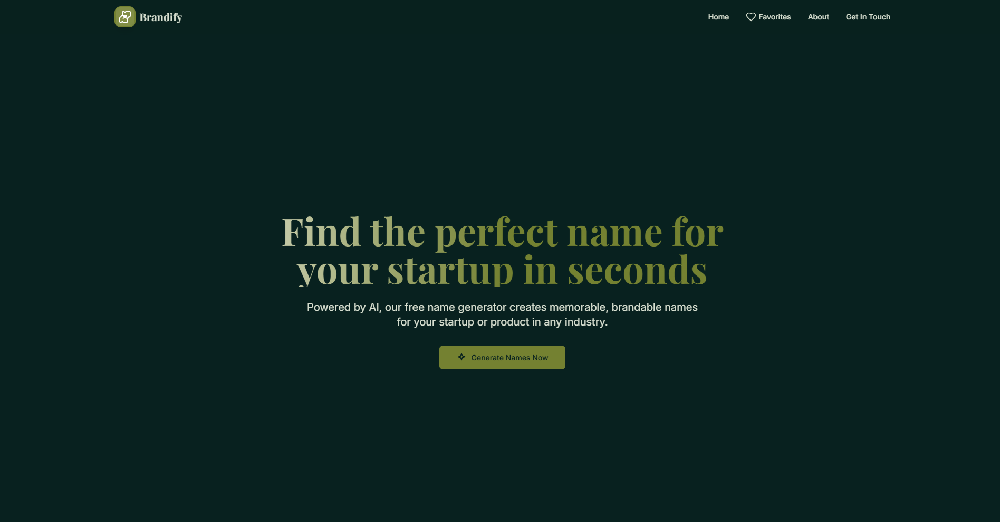
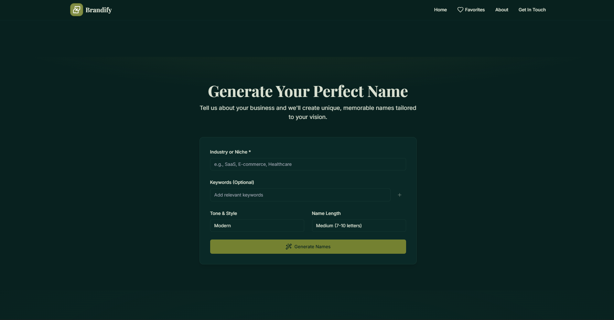
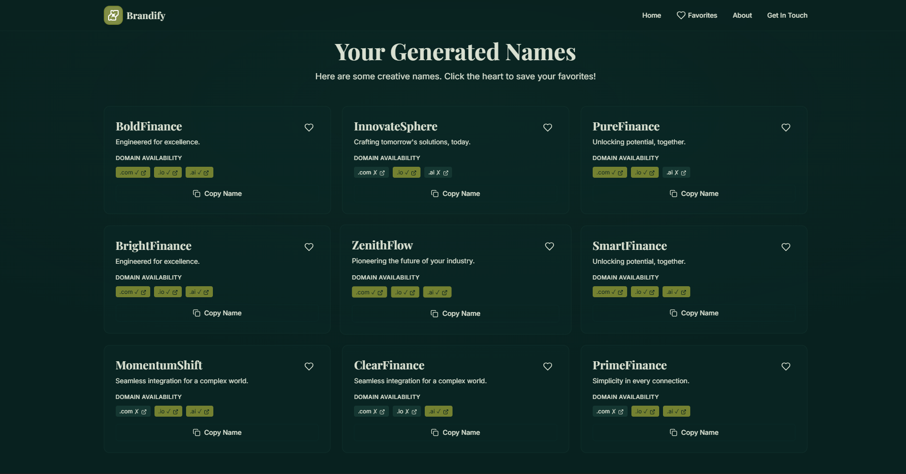

# 🚀 Brandify - AI-Powered Startup Name Generator

<div align="center">
  
  
  
  
</div>

## 🌟 Overview

**Brandify** is a free, AI-powered startup and product name generator that helps entrepreneurs find the perfect brandable name for their business in seconds. Built with modern web technologies, it combines artificial intelligence with an elegant user interface to deliver memorable, creative names tailored to any industry.

### ✨ Key Features

- 🤖 **AI-Powered Generation**: Advanced algorithms create unique, brandable names
- 🎯 **Industry-Specific**: Tailored suggestions for any business niche
- ⚡ **Lightning Fast**: Generate 9 unique names in under 2 seconds
- 🔍 **Domain Availability**: Real-time domain availability checking (.com, .io, .ai)
- ❤️ **Favorites System**: Save and manage your preferred names
- 📱 **Fully Responsive**: Beautiful experience on all devices
- 🎨 **Modern UI/UX**: Glass morphism design with smooth animations
- 🌐 **Global Community**: Join 500+ contributors from 21+ countries

## 📸 Screenshots

### Hero Section
Beautiful gradient hero with call-to-action and smooth animations

 

### Name Generator Form
Intuitive form with industry selection, keyword input, tone selection, and length preferences



### Results Display
Professional name cards with taglines, domain availability, and favorites functionality



## 🛠️ Tech Stack

### Frontend
- **React 18.2.0** - Component-based UI framework
- **Tailwind CSS** - Utility-first CSS framework
- **Custom CSS Variables** - Dynamic theming system
- **Vanilla JavaScript** - Core functionality

### Design
- **Playfair Display** - Elegant serif font for headings
- **Inter** - Modern sans-serif font for body text
- **Glass Morphism** - Modern design aesthetic with backdrop blur
- **Gradient Animations** - Smooth scroll-triggered effects
- **Dark Theme** - Professional dark green color scheme

### Features
- **Intersection Observer API** - Scroll animations
- **Local Storage** - Favorites persistence
- **Responsive Grid** - Mobile-first design
- **Custom Hooks** - Reusable animation logic

## 🚀 Getting Started

### Prerequisites
- Modern web browser (Chrome, Firefox, Safari, Edge)
- Basic understanding of HTML/CSS/JavaScript (for development)

### Installation

1. **Clone the repository**
```bash
git clone https://github.com/IleshDevX/Brandify.git
cd Brandify
```

2. **Open in browser**
```bash
# Option 1: Direct file opening
open index.html

# Option 2: Local server (recommended)
python -m http.server 8000
# or
npx serve .
```

3. **Start generating names!**
   - Enter your industry/niche
   - Add relevant keywords (optional)
   - Select tone and length preferences
   - Click "Generate Names Now"

## 🎨 Design Features

### Color Scheme
- **Primary**: Deep green (#809038) - Trust and growth
- **Accent**: Rich green (#2D5347) - Professional depth
- **Background**: Dark emerald (#0A2F2A) - Modern elegance
- **Card**: Subtle transparency with backdrop blur

### Animations
- **Scroll Triggers**: Elements animate into view
- **Parallax Effects**: Subtle depth on hero section
- **Hover States**: Interactive feedback on all elements
- **Loading States**: Smooth transitions during generation

### Typography
- **Headings**: Playfair Display (serif) for elegance
- **Body**: Inter (sans-serif) for readability
- **Gradients**: Text gradients for visual hierarchy

## 📊 Performance

- ⚡ **Fast Loading**: Optimized assets and code splitting
- 📱 **Mobile Optimized**: 100% responsive design
- 🎯 **SEO Friendly**: Semantic HTML and meta tags
- ♿ **Accessible**: ARIA labels and keyboard navigation

## 🌍 Community Stats

- **21+** Countries represented
- **500+** Active contributors
- **500K+** Names generated
- **Growing** Global community

## 🎯 Use Cases

### Startups
- SaaS companies
- E-commerce brands
- Tech startups
- Mobile apps

### Industries
- Healthcare
- Finance
- Education
- Entertainment
- Real Estate
- Food & Beverage

### Name Types
- Brand names
- Product names
- Company names
- App names
- Domain names

## 🔮 Future Enhancements

- [ ] **AI Model Improvements**: Enhanced name generation algorithms
- [ ] **Industry Templates**: Pre-built naming patterns for specific sectors
- [ ] **Logo Suggestions**: AI-generated logo concepts for names
- [ ] **Name Analytics**: Brandability scoring and market analysis
- [ ] **Social Media Checks**: Username availability across platforms
- [ ] **Export Features**: PDF reports and name lists
- [ ] **Team Collaboration**: Share and collaborate on name selections
- [ ] **API Access**: Programmatic access to name generation

## 👨‍💻 Developer

**Ilesh Patel** - Full-Stack Developer & Data Analyst

- 💼 **Expertise**: Frontend & Backend Development, Responsive Design, Performance Optimization
- 🛠️ **Technologies**: JavaScript, HTML5, Python, CSS3
- 🎯 **Focus**: User-centered development and beautiful digital experiences
- 📱 **Social**: 

[](https://www.instagram.com/ilesh.009)
[](https://x.com/Ilesh_009)
[](https://www.facebook.com/share/1Akw57qagC/)
[](https://www.youtube.com/@ileshpatel666)
[](https://github.com/IleshDevX)

## 🤝 Contributing

Contributions, issues, and feature requests are welcome! Feel free to check the [issues page](https://github.com/IleshDevX/Brandify/issues).

### How to Contribute

1. Fork the repository
2. Create your feature branch (`git checkout -b feature/AmazingFeature`)
3. Commit your changes (`git commit -m 'Add some AmazingFeature'`)
4. Push to the branch (`git push origin feature/AmazingFeature`)
5. Open a Pull Request

## 🙏 Acknowledgments

- **Design Inspiration**: Modern SaaS platforms and AI tools
- **Color Palette**: Professional brand guidelines
- **Typography**: Google Fonts for web-optimized fonts
- **Icons**: Custom SVG icons for consistency
- **Community**: Feedback from entrepreneurs and developers

## 📞 Support

If you like this project, please give it a ⭐ on GitHub!

For support, email me or connect through social media links above.

---

<div align="center">
  <p><strong>Built with ❤️ by <a href="https://github.com/IleshDevX">IleshDevX</a> for entrepreneurs worldwide</strong></p>
  <p><em>© 2025 Brandify. Names generated are free for personal use.</em></p>
</div>
